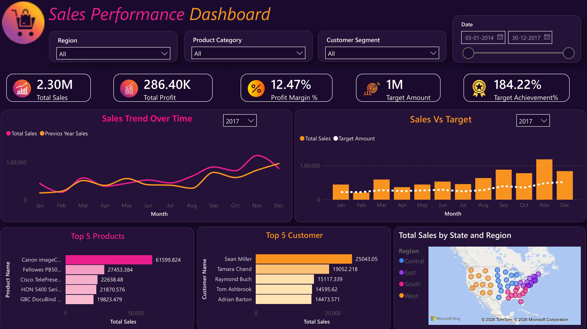
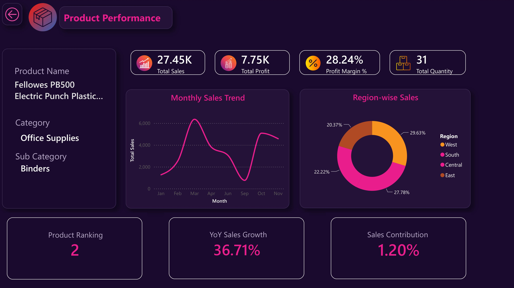
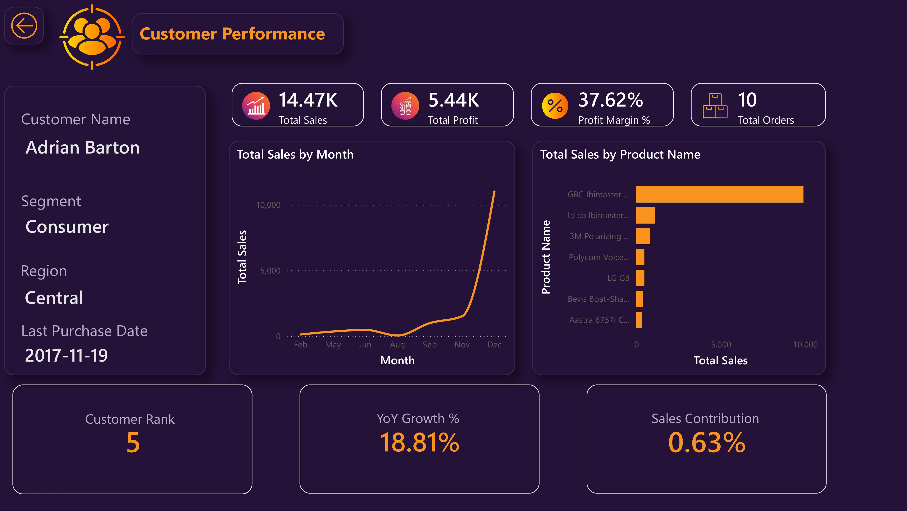

# Power BI Sales Performance & Customer Analytics Dashboard

## 📊 Project Overview

This project is an interactive Power BI dashboard designed to analyze
sales performance, profitability, product performance, and customer
behavior using the Superstore dataset.

The dashboard provides both high-level business insights and detailed
product- and customer-level analysis through interactive filters and
drill-through pages.

## 🎯 Objectives

- Analyze overall sales and profit performance
- Track profit margin and target achievement
- Identify sales trends over time
- Compare sales against targets
- Identify top-performing products and customers
- Analyze regional sales performance
- Understand individual product performance
- Analyze individual customer performance
- Provide interactive insights using drill-through and tooltip pages

## 🛠️ Tools & Technologies

- Power BI
- DAX
- Power Query
- Data Modeling
- Data Visualization
- Microsoft Bing Maps

## 📌 Dashboard Pages

### 1. Sales Performance

The main dashboard provides an overview of business performance through:

- Total Sales
- Total Profit
- Profit Margin %
- Target Amount
- Target Achievement %
- Sales Trend Over Time
- Sales vs Target
- Top 5 Products
- Top 5 Customers
- Sales by State and Region

### 2. Product Performance

The Product Performance page provides detailed analysis of a
selected product, including:

- Total Sales
- Total Profit
- Profit Margin
- Total Quantity
- Monthly Sales Trend
- Region-wise Sales
- Product Ranking
- YoY Sales Growth
- Sales Contribution

### 3. Customer Performance

The Customer Performance page provides detailed analysis of a
selected customer, including:

- Total Sales
- Total Profit
- Profit Margin
- Total Orders
- Monthly Sales Trend
- Sales by Product
- Customer Rank
- YoY Growth
- Sales Contribution

### 4. Interactive Tooltips

The dashboard includes custom report-page tooltips for Products and
Customers.

When hovering over a product or customer in the main dashboard,
the tooltip displays additional key insights without requiring
the user to navigate away from the page.

This provides a quick way to explore additional information while
keeping the main dashboard clean and interactive.

## 🔍 Interactivity

The report includes:

- Region filter
- Product Category filter
- Customer Segment filter
- Date range filter
- Year selection
- Product drill-through
- Customer drill-through

## 📈 Key Skills Demonstrated

- Data cleaning and transformation
- Data modeling
- DAX measures
- KPI development
- Time-series analysis
- YoY analysis
- Target vs actual analysis
- Drill-through reporting
- Interactive dashboard design
- Business-focused data visualization

## 📷 Dashboard Preview

### Sales Performance

### Product Performance

### Customer Performance

## 🚀 Try it out interactively!

You can download the full Power BI report file to explore the interactive filters, data model, and DAX measures locally on your machine.

👉 **[Download the Interactive .pbix File](PowerBI/Sales_Performance.pbix)**

*(Note: You will need Microsoft Power BI Desktop installed to open this file.)*
